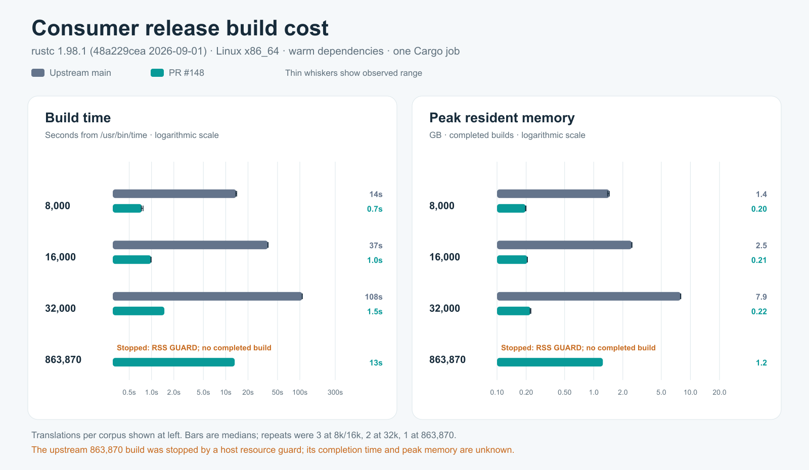
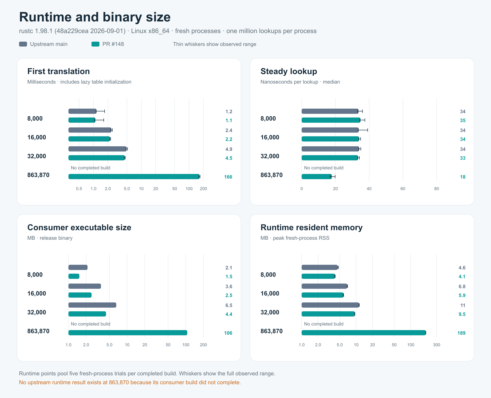

# Current-head, same-base Linux benchmark

This compares upstream `main` at `fb1deb45f4fafa8fec708d97051a3a0031d2cd5c`
with [PR #148](https://github.com/longbridge/rust-i18n/pull/148) at
`538b338c76ccace3758545deeb29a1b76b19de24`. The Linux x86_64 runs used
Rust and Cargo 1.98.1, warmed dependencies, one Cargo job, incremental
compilation disabled, and release consumer builds. All measured builds
recompiled the consumer. These are synthetic YAML corpora and a single English
lookup key, not an application workload.

The [regular run](https://github.com/nickpresta/rust-i18n/actions/runs/36505496704)
completed at 8,000, 16,000, and 32,000 translations. A separate
[tiny run](https://github.com/nickpresta/rust-i18n/actions/runs/36505507344)
checked 256 translations, within upstream's small-table lookup path. The
[xlarge run](https://github.com/nickpresta/rust-i18n/actions/runs/36505502210)
attempted 863,870 translations.

## Completed build comparisons

`/usr/bin/time` wall time and maximum resident set size are medians, with the
full observed range in parentheses. RSS uses decimal GB. Each version ran
three builds at 8k and 16k, and two at 32k; pair order alternated. The same
corpus was linked into both consumer crates at each size.

| Translations | Upstream build | PR build | Upstream peak RSS | PR peak RSS |
| ---: | ---: | ---: | ---: | ---: |
| 8,000 | 13.87 s (13.69–14.08) | 0.74 s (0.73–0.77) | 1.449 GB (1.390–1.450) | 0.197 GB (0.197–0.200) |
| 16,000 | 37.09 s (37.07–37.36) | 0.99 s (0.98–0.99) | 2.477 GB (2.468–2.492) | 0.206 GB (0.206–0.206) |
| 32,000 | 107.695 s (107.43–107.96) | 1.49 s (1.49–1.49) | 7.932 GB (7.903–7.960) | 0.222 GB (0.220–0.224) |

At 32k, the median consumer build was 72.3 times faster and used 35.7 times
less peak resident memory with the PR. All 16 regular-tier builds completed;
none triggered a resource guard.

## Larger corpus: guarded upstream attempt

The 49-locale, 17,630-key corpus contains **863,870 translations** and
87,607,370 YAML bytes. The PR consumer build completed in **13.24 s** by
`/usr/bin/time` (one sample), with **1.243 GB** peak RSS. Five fresh-process
runtime trials then succeeded. The upstream build crossed the configured
**9 GiB process-group RSS guard after 91.29 s**, at a sampled
**9,669,193,728 bytes** (9.005 GiB), and was stopped. It produced no
executable. Its completion time, completed-build peak RSS, executable size,
and runtime behavior are unknown. The 91.29 s is time to the guard trigger,
not a completed build time or an xlarge speedup measurement.

## Runtime probes

Every completed build ran five fresh-process trials. First translation includes
lazy table initialization; steady lookup averages one million calls of the
same English key. Values are medians with observed ranges. RSS and executable
size use decimal MB.

| Translations | Version | First translation | Steady lookup | Runtime RSS | Executable |
| ---: | --- | ---: | ---: | ---: | ---: |
| 8,000 | Upstream | 1.161 ms (1.137–1.711) | 33.71 ns (33.15–36.06) | 4.567 MB (4.547–4.735) | 2.118 MB |
| 8,000 | PR | 1.101 ms (1.055–1.641) | 34.87 ns (34.46–37.46) | 4.088 MB (4.030–4.129) | 1.535 MB |
| 16,000 | Upstream | 2.380 ms (2.310–2.498) | 33.78 ns (33.53–39.10) | 6.820 MB (6.775–6.971) | 3.590 MB |
| 16,000 | PR | 2.224 ms (2.202–2.290) | 34.02 ns (33.79–34.92) | 5.865 MB (5.730–5.882) | 2.481 MB |
| 32,000 | Upstream | 4.930 ms (4.807–5.165) | 34.08 ns (33.75–35.04) | 11.293 MB (11.276–11.424) | 6.539 MB |
| 32,000 | PR | 4.538 ms (4.432–4.641) | 33.465 ns (33.19–34.23) | 9.454 MB (9.376–9.462) | 4.378 MB |
| 863,870 | PR only | 165.709 ms (160.069–169.884) | 17.91 ns (16.88–19.85) | 189.489 MB (189.379–189.510) | 105.876 MB |

Steady-lookup differences are small, vary in direction, and have overlapping
trial ranges at the completed paired sizes. The xlarge PR runtime has no
upstream counterpart.

## Tiny corpus: upstream small-table path

The separate run used 8 locales × 32 keys = 256 translations, three paired
builds per version, and 15 runtime trials per version. Medians and ranges:

| Metric | Upstream | PR |
| --- | ---: | ---: |
| Build time | 0.75 s (0.75–0.76) | 0.75 s (0.75–0.76) |
| Build peak RSS | 198.02 MiB (198.01–200.20) | 198.40 MiB (198.32–198.42) |
| First translation | 49.393 µs (46.157–52.999) | 50.334 µs (45.406–65.754) |
| Steady lookup | 14.94 ns (14.76–16.59) | 14.78 ns (14.75–15.46) |
| Runtime peak RSS | 2.219 MiB (2.129–2.223) | 2.203 MiB (2.117–2.270) |
| Executable | 646,488 bytes | 646,496 bytes |

The tiny-tier build costs are nearly equal. Its small runtime differences are
within overlapping observed ranges.

## Evidence and method

| Run | Raw results | Metadata | Logs |
| --- | --- | --- | --- |
| [Tiny](https://github.com/nickpresta/rust-i18n/actions/runs/36505507344) | [JSONL](data/final-head-linux-tiny-results.jsonl) | [JSON](data/final-head-linux-tiny-metadata.json) | [ZIP](data/final-head-linux-tiny-logs.zip) |
| [Regular](https://github.com/nickpresta/rust-i18n/actions/runs/36505496704) | [JSONL](data/final-head-linux-regular-results.jsonl) | [JSON](data/final-head-linux-regular-metadata.json) | [ZIP](data/final-head-linux-regular-logs.zip) |
| [Xlarge](https://github.com/nickpresta/rust-i18n/actions/runs/36505502210) | [JSONL](data/final-head-linux-xlarge-results.jsonl) | [JSON](data/final-head-linux-xlarge-metadata.json) | [ZIP](data/final-head-linux-xlarge-logs.zip) |

The charts are also available as [build SVG](images/final-head-linux/build.svg)
and [runtime SVG](images/final-head-linux/runtime.svg). They combine the regular
and xlarge runs; the tiny run is shown in its table above. For all three runs,
metadata confirms the pinned SHAs and Rust 1.98.1. Every tier's rows share one
corpus SHA-256, and all completed runtime trials produced the same checksum.
The [runner](run_matrix.py) warmed both versions' dependencies, serialized
`cargo build --release --offline --locked --bin bench_i18n`, and stopped the
xlarge matrix after its first guarded upstream attempt. Guards were 9 GiB
sampled process-group RSS, 900 s per build, 2 GiB free disk, and 15% available
host memory. The workflow is [pinned here](../../.github/workflows/packed-translations-benchmark.yml).

The [earlier latest-main report](latest-main-2026-09-28.md) measured a
different-base PR head; its numbers are kept separate from this comparison.
