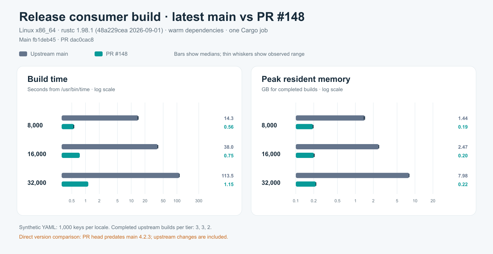

# Latest-main compile comparison, 2026-09-28

[GitHub Actions run 36503525570](https://github.com/nickpresta/rust-i18n/actions/runs/36503525570)
compared upstream main `fb1deb45f4fafa8fec708d97051a3a0031d2cd5c`
(4.2.3) with the exact [PR #148](https://github.com/longbridge/rust-i18n/pull/148)
head `dac0cac8f9dd10a166bfef4c377f541ec6faefc7` (4.2.2). Every measured
build completed; no resource guard triggered.

| Translations | Main build | PR build | Main peak RSS | PR peak RSS | Runs per version |
| ---: | ---: | ---: | ---: | ---: | ---: |
| 8,000 | 14.29 s | 0.56 s | 1.441 GB | 0.195 GB | 3 |
| 16,000 | 38.04 s | 0.75 s | 2.470 GB | 0.202 GB | 3 |
| 32,000 | 113.48 s | 1.15 s | 7.978 GB | 0.218 GB | 2 |

Times are medians from `/usr/bin/time` for release consumer builds after both
versions' dependencies were warmed. RSS is the median maximum resident set size
of those completed builds, in decimal GB. Builds ran serially on GitHub Actions
Linux x86_64 with Rust and Cargo 1.98.1, one Cargo job, and incremental
compilation disabled. The same deterministic YAML files were linked into both
consumer crates at each tier: 8/16/32 locales, 1,000 keys per locale, and
799,613/1,597,783/3,197,799 YAML bytes respectively. The runner alternated
version order for each repeated pair and verified that the consumer crate
actually recompiled in all 16 measured builds. Runtime trials were disabled.

The timed command was `cargo build --release --offline --locked --bin bench_i18n`.
The run had a 9 GiB process-group RSS cap, a 900-second per-build cap, a 2 GiB
free-disk floor, and a 15% available-memory floor. Its runner stops the matrix
after any failed or guarded build, preventing another attempt under pressure.
See the [exact workflow](../../.github/workflows/packed-translations-benchmark.yml)
and [runner](run_matrix.py) for setup and guard behavior.

This is a **direct comparison of different bases**. Upstream main gained lookup
and backend changes after PR #148 branched, so the numbers do not isolate the
PR's effect on 4.2.3. Each corpus has 1,000 keys per locale, beyond main's new
small-table static lookup threshold. This run did not attempt the 863,870-entry
upstream build; it was previously stopped by a host resource guard.

The [raw JSONL](data/latest-main-linux-results.jsonl),
[run metadata](data/latest-main-linux-metadata.json),
[build logs](data/latest-main-linux-logs.zip), and
[SVG chart](images/latest-main-linux/build.svg) are archived here. The
GitHub Actions run also retains its original artifact for 14 days.
